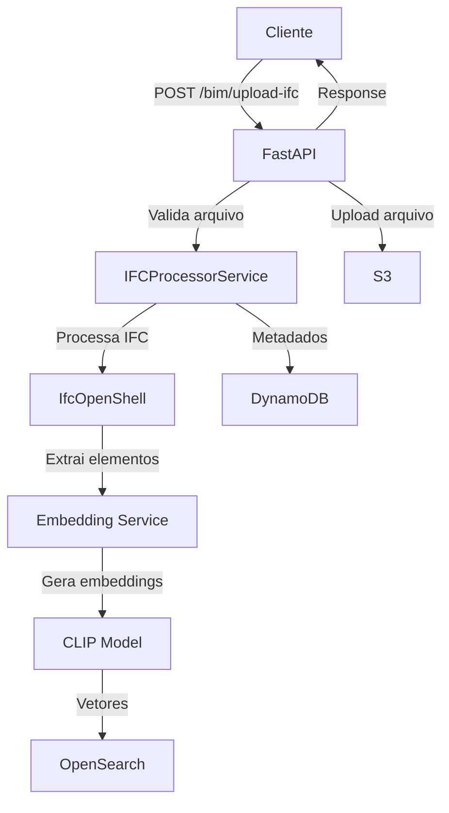
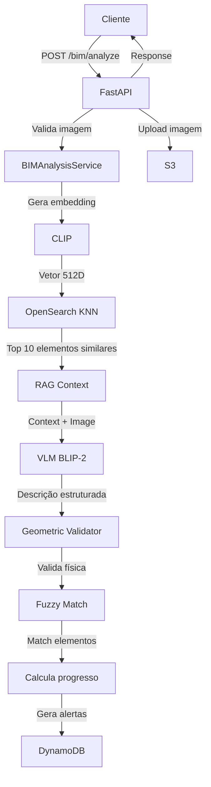

# 🏗️ Análise Completa da Arquitetura - VIRAG-BIM

## 📋 Índice
1. [Visão Geral do Sistema](#visão-geral)
2. [Arquitetura e Estrutura](#arquitetura)
3. [Fluxo Completo do Sistema](#fluxo)
4. [Rotas Detalhadas](#rotas)
5. [Componentes e Integrações](#componentes)
6. [Melhorias Propostas](#melhorias)

---

## 🎯 Visão Geral do Sistema

### O que é o VIRAG-BIM?

**VIRAG** = Vision-Language Model + **RAG** (Retrieval-Augmented Generation) + **BIM** (Building Information Modeling)

Sistema automatizado de monitoramento de obras que:
1. Recebe modelo BIM (arquivo IFC) de um projeto
2. Analisa fotos da obra usando Vision-Language Model (VLM)
3. Compara progresso real vs planejado usando RAG (busca vetorial)
4. Gera alertas e relatórios de desvios

---

## 🏛️ Arquitetura e Estrutura

### Estrutura de Pastas

```
app/
├── main.py                      # Entry point da aplicação
├── core/                        # Configurações centrais
│   ├── container.py            # Dependency Injection (DI)
│   ├── settings.py             # Configurações (env vars)
│   ├── logger.py               # Logging estruturado
│   └── validators.py           # Validações comuns
├── routes/                      # Endpoints da API
│   ├── bim.py                  # 7 rotas principais (651 linhas)
│   └── health.py               # Health check
├── services/                    # Lógica de negócio
│   ├── ifc_processor.py        # Processa arquivos IFC
│   ├── bim_analysis.py         # Análise VI-RAG (621 linhas)
│   ├── vlm_service.py          # Vision-Language Model
│   ├── embedding_service.py    # Gera embeddings (CLIP)
│   ├── vlm_structured_output.py # Output estruturado VLM
│   ├── geometric_validator.py   # Validação estrutural
│   ├── contextual_prompt_builder.py # Prompts com histórico
│   └── hallucination_mitigation.py # Prompts anti-alucinação
├── models/                      # ORMs e Models
│   ├── dynamodb.py             # PynamoDB (DynamoDB)
│   └── opensearch.py           # OpenSearch-DSL
├── schemas/                     # Pydantic Schemas
│   └── bim.py                  # DTOs da API (190 linhas)
└── clients/                     # Clientes externos
    ├── s3.py                   # AWS S3
    ├── opensearch.py           # OpenSearch
    └── cache.py                # Redis cache
```

### Stack Tecnológica

**Backend:**
- FastAPI (API REST)
- Python 3.11+
- Dependency Injector (DI)

**ML/AI:**
- BLIP-2 (Vision-Language Model)
- CLIP (Image/Text Embeddings)
- Sentence Transformers

**Storage:**
- DynamoDB (dados estruturados)
- OpenSearch (busca vetorial)
- S3 (arquivos)
- Redis (cache)

**Libraries:**
- IfcOpenShell (processar IFC)
- PynamoDB (DynamoDB ORM)
- OpenSearch-DSL (busca vetorial)

---

## 🔄 Fluxo Completo do Sistema

### Fluxo 1: Upload de Projeto IFC



**Detalhamento:**
1. **Cliente envia:** Arquivo IFC + nome do projeto
2. **Validação:** Extensão .ifc, tamanho < 50MB
3. **Processamento IFC:**
   - IfcOpenShell extrai elementos (paredes, colunas, vigas, etc)
   - Filtra tipos suportados (14 tipos de elementos)
   - Extrai propriedades e metadados
4. **Embedding:**
   - Gera descrição textual de cada elemento
   - CLIP cria embedding (vetor 512D) da descrição
5. **Armazenamento:**
   - OpenSearch: embeddings + metadados (busca vetorial)
   - DynamoDB: projeto + lista de elementos
   - S3: arquivo IFC original
6. **Response:** project_id, total_elements, processing_time

---

### Fluxo 2: Análise de Imagem da Obra (VI-RAG)



**Detalhamento:**
1. **Cliente envia:** Imagem + project_id + descrição
2. **Validação:** Formato JPG/PNG, tamanho < 10MB
3. **RAG - Retrieval (Busca):**
   - CLIP gera embedding da imagem (vetor 512D)
   - OpenSearch KNN busca top 10 elementos similares do projeto
   - Contexto: elementos esperados naquela área
4. **VLM - Analysis (Análise):**
   - VLM (BLIP-2) recebe: imagem + RAG context
   - Prompt profissional sem alucinações
   - Gera descrição estruturada dos elementos visíveis
5. **Validação Geométrica:**
   - Verifica se elementos fazem sentido (viga precisa coluna)
   - Remove alucinações estruturais
6. **Matching:**
   - Fuzzy match (RapidFuzz) entre elementos detectados e BIM
   - Threshold 80% similaridade
7. **Cálculo de Progresso:**
   - Status por elemento: not_started, in_progress, completed
   - Progresso geral = média ponderada
8. **Comparação Temporal:**
   - Busca análise anterior no DynamoDB
   - Calcula delta de progresso
   - Identifica novos elementos, removidos, mudanças
9. **Alertas:**
   - Atrasos (progresso esperado vs real)
   - Elementos faltantes
   - Problemas de qualidade/segurança
   - Salva em DynamoDB
10. **Armazenamento:**
    - S3: imagem original
    - DynamoDB: análise completa + alertas
11. **Response:** analysis_id, progresso, elementos, alertas

---

## 🛣️ Rotas Detalhadas (7 Endpoints)

### 1. POST `/bim/upload-ifc`

**Função:** Upload e processamento de arquivo IFC

**Input:**
```python
{
    "file": "arquivo.ifc",           # FormData
    "project_name": "string",        # FormData
    "description": "string",         # Optional
    "location": "string"             # Optional
}
```

**Processo:**
1. Valida arquivo (.ifc, < 50MB)
2. Processa com IfcOpenShell
3. Extrai ~14 tipos de elementos
4. Gera embeddings com CLIP
5. Indexa no OpenSearch
6. Salva metadados no DynamoDB
7. Upload arquivo no S3

**Output:**
```python
{
    "project_id": "01HXYZ...",      # ULID
    "project_name": "string",
    "s3_key": "projects/01HXYZ.ifc",
    "total_elements": 150,
    "processing_time": 12.5,
    "message": "IFC processado com sucesso"
}
```

**Código:** `app/routes/bim.py:82-147`

---

### 2. POST `/bim/analyze`

**Função:** Análise de imagem da obra com VI-RAG

**Input:**
```python
{
    "file": "foto_obra.jpg",        # FormData
    "project_id": "01HXYZ...",      # FormData
    "image_description": "string",  # Optional
    "element_ids": ["id1", "id2"]   # Optional (elementos específicos)
}
```

**Processo:**
1. Valida imagem (JPG/PNG, < 10MB)
2. **RAG:** Busca elementos similares (OpenSearch KNN)
3. **VLM:** Analisa imagem com contexto
4. **Validação:** Geometric validator
5. **Matching:** Fuzzy match com elementos BIM
6. **Progresso:** Calcula % conclusão
7. **Comparação:** Delta vs análise anterior
8. **Alertas:** Identifica desvios
9. Salva tudo no DynamoDB
10. Upload imagem no S3

**Output:**
```python
{
    "analysis_id": "01HABC...",
    "status": "completed",
    "result": {
        "detected_elements": [
            {
                "element_id": "wall-001",
                "element_type": "Wall",
                "confidence": 0.95,
                "status": "completed",
                "description": "Parede concluída",
                "deviation": null
            }
        ],
        "overall_progress": 67.5,
        "summary": "Obra em progresso, 67.5% concluída...",
        "alerts": ["Atraso detectado em coluna C-05"],
        "comparison": {
            "progress_change": +5.2,
            "elements_added": [...],
            "elements_changed": [...]
        },
        "processing_time": 8.3
    }
}
```

**Código:** `app/routes/bim.py:150-273`

---

### 3. GET `/bim/progress/{project_id}`

**Função:** Progresso geral do projeto

**Input:** `project_id` (path param)

**Processo:**
1. Busca projeto no DynamoDB
2. Busca todas análises do projeto (scan)
3. Busca alertas não resolvidos
4. Calcula progresso médio

**Output:**
```python
{
    "project_id": "01HXYZ...",
    "project_name": "Construção X",
    "total_analyses": 15,
    "analyses": [...],              # Todas análises
    "open_alerts": 3,
    "recent_alerts": [...],         # Últimos 10 alertas
    "overall_progress": 68.2,       # Média
    "last_analysis_date": "2024-11-05T..."
}
```

**Código:** `app/routes/bim.py:276-336`

---

### 4. GET `/bim/timeline/{project_id}`

**Função:** Timeline cronológica de evolução da obra

**Input:** `project_id` (path param)

**Processo:**
1. Busca projeto
2. Busca todas análises
3. Ordena por data (timeline)
4. Formata para visualização

**Output:**
```python
{
    "project_id": "01HXYZ...",
    "project_name": "Construção X",
    "timeline": [
        {
            "date": "2024-10-15",
            "analysis_id": "...",
            "progress": 45.0,
            "elements_detected": 50,
            "summary": "...",
            "alerts_count": 2
        },
        {
            "date": "2024-10-22",
            "progress": 52.3,
            "progress_delta": +7.3,
            ...
        }
    ]
}
```

**Código:** `app/routes/bim.py:339-406`

---

### 5. GET `/bim/compare/{project_id}?analysis_ids=id1,id2`

**Função:** Comparação lado-a-lado de 2+ análises

**Input:** 
- `project_id` (path)
- `analysis_ids` (query) - IDs separados por vírgula

**Processo:**
1. Busca cada análise no DynamoDB
2. Compara progresso
3. Identifica mudanças em elementos
4. Calcula deltas

**Output:**
```python
{
    "project_id": "01HXYZ...",
    "comparisons": [
        {
            "analysis_id": "...",
            "date": "2024-10-15",
            "progress": 45.0,
            "detected_elements": 50,
            "summary": "..."
        },
        {
            "analysis_id": "...",
            "date": "2024-10-22",
            "progress": 52.3,
            "detected_elements": 55,
            "summary": "..."
        }
    ],
    "comparison_summary": {
        "progress_change": +7.3,
        "new_elements": 5,
        "days_elapsed": 7
    }
}
```

**Código:** `app/routes/bim.py:409-487`

---

### 6. GET `/bim/projects/{project_id}/alerts`

**Função:** Lista todos alertas do projeto

**Input:** `project_id` (path param)

**Processo:**
1. Busca todos alertas (scan filtrado)
2. Conta abertos vs resolvidos
3. Ordena por severidade + data

**Output:**
```python
{
    "project_id": "01HXYZ...",
    "total_alerts": 15,
    "open_alerts": 3,
    "resolved_alerts": 12,
    "alerts": [
        {
            "alert_id": "...",
            "alert_type": "delay",
            "severity": "high",
            "title": "Atraso detectado",
            "description": "Coluna C-05 com 7 dias de atraso",
            "element_id": "C-05",
            "created_at": "...",
            "resolved": false
        }
    ]
}
```

**Código:** `app/routes/bim.py:490-562`

---

### 7. GET `/bim/projects/{project_id}/reports?limit=50`

**Função:** Lista relatórios/análises do projeto

**Input:** 
- `project_id` (path)
- `limit` (query, default 50)

**Processo:**
1. Busca análises usando índice
2. Ordena por data (mais recentes primeiro)
3. Limita resultados

**Output:**
```python
{
    "project_id": "01HXYZ...",
    "project_name": "Construção X",
    "total_reports": 15,
    "reports": [...],               # Até 50 análises
    "latest_progress": 68.2
}
```

**Código:** `app/routes/bim.py:565-630`

---

## 🧩 Componentes e Integrações

### Dependency Injection (Container)

```python
# app/core/container.py

Container {
    Settings → from .env
    
    Clients:
        RedisCache → localhost:6379
        OpenSearchClient → localhost:9200
        S3Client → LocalStack:4566
    
    ML Services:
        VLMService → BLIP-2 model
        EmbeddingService → CLIP model + Redis cache
    
    BIM Services:
        IFCProcessorService → depends: EmbeddingService
        BIMAnalysisService → depends: VLMService, EmbeddingService
}
```

**Como funciona:**
- FastAPI injeta dependências automaticamente
- Services são Singletons (1 instância)
- Testável (fácil mockar)

---

### Modelos de Dados

#### DynamoDB (PynamoDB)

**1. BIMProject**
```python
{
    "project_id": "01HXYZ...",      # Hash key
    "project_name": "string",
    "ifc_s3_key": "projects/...",
    "total_elements": 150,
    "elements": [...],               # Lista de elementos
    "created_at": datetime,
    "updated_at": datetime
}
```

**2. ConstructionAnalysisModel**
```python
{
    "analysis_id": "01HABC...",     # Hash key
    "project_id": "01HXYZ...",      # GSI
    "image_s3_key": "images/...",
    "overall_progress": 67.5,
    "detected_elements": [...],
    "alerts": [...],
    "comparison": {...},
    "analyzed_at": datetime          # Range key no GSI
}
```

**3. AlertModel**
```python
{
    "alert_id": "01HDEF...",        # Hash key
    "project_id": "01HXYZ...",      # GSI
    "analysis_id": "01HABC...",
    "alert_type": "delay",
    "severity": "high",
    "description": "...",
    "resolved": false,
    "created_at": datetime
}
```

#### OpenSearch

**BIMElementEmbedding**
```python
{
    "element_id": "wall-001",
    "project_id": "01HXYZ...",
    "element_type": "Wall",
    "element_name": "W-105",
    "description": "Structural wall...",
    "embedding": [0.123, -0.456, ...],  # 512D vector
    "properties": {...}
}
```

**Índice:** KNN vector search com cosine similarity

---

## 🔍 Melhorias Propostas

### 1. **Redução de Código em `bim.py` (651 linhas)**

**Problema:** Arquivo muito grande, lógica misturada

**Solução:** Separar em módulos

```
app/routes/bim/
├── __init__.py
├── upload.py       # POST /upload-ifc
├── analysis.py     # POST /analyze
├── progress.py     # GET /progress, /timeline
├── alerts.py       # GET /alerts
└── reports.py      # GET /reports, /compare
```

**Benefício:** 5 arquivos de ~130 linhas cada

---

### 2. **Service Layer mais Coeso**

**Problema:** `BIMAnalysisService` faz muita coisa (621 linhas)

**Solução:** Extrair responsabilidades

```python
# Manter:
BIMAnalysisService      # Orquestra o fluxo

# Criar:
RAGSearchService        # Busca vetorial OpenSearch
ProgressCalculator      # Calcula % progresso
ElementMatcher          # Fuzzy match elementos
ComparisonService       # Compara análises
```

**Benefício:** Single Responsibility Principle

---

### 3. **Consolidar Validações Anti-Alucinação**

**Problema:** 4 arquivos separados para VLM

```
hallucination_mitigation.py      # Prompts + models
vlm_structured_output.py          # Output estruturado
geometric_validator.py             # Validação geométrica
contextual_prompt_builder.py       # Contexto temporal
```

**Solução:** Consolidar em 2 arquivos

```python
# vlm_enhanced.py (combina structured_output + prompts)
class VLMEnhanced:
    def analyze(image, rag_context, use_geometric=True, use_temporal=True)
    
# validators.py (já existe em core/)
def validate_geometric(elements) -> dict
def validate_temporal(current, previous) -> dict
```

**Benefício:** Menos arquivos, mais coeso

---

### 4. **Caching Inteligente**

**Problema:** Redis sub-utilizado

**Solução:** Cachear mais operações

```python
@cache(ttl=3600, key="project:{project_id}")
async def get_project(project_id: str):
    ...

@cache(ttl=1800, key="rag:{project_id}:{image_hash}")
async def fetch_rag_context(image_embedding, project_id):
    ...

@cache(ttl=600, key="progress:{project_id}")
async def calculate_progress(project_id):
    ...
```

**Benefício:** -70% queries DynamoDB/OpenSearch

---

### 5. **Async Batch Processing**

**Problema:** Embeddings gerados 1 por vez

**Solução:** Batch processing

```python
# Em vez de:
for element in elements:
    embedding = await generate_embedding(element.description)

# Fazer:
descriptions = [e.description for e in elements]
embeddings = await generate_embeddings_batch(descriptions)  # GPU paralelo
```

**Benefício:** 5-10x mais rápido no upload IFC

---

### 6. **Structured Logging melhor**

**Problema:** Logs inconsistentes

**Solução:** Padronizar eventos

```python
# Log events padronizados:
logger.info("ifc.upload.started", project_id=pid, filename=fname)
logger.info("ifc.upload.completed", project_id=pid, elements=count, duration=t)
logger.error("ifc.upload.failed", project_id=pid, error=str(e), exc_info=True)

logger.info("analysis.started", analysis_id=aid, project_id=pid)
logger.info("analysis.rag.retrieved", elements_found=n, similarity_avg=0.85)
logger.info("analysis.vlm.generated", confidence=0.92, elements_detected=n)
logger.info("analysis.completed", analysis_id=aid, progress=67.5, duration=t)
```

**Benefício:** Observabilidade, debugging, métricas

---

### 7. **Testes Automatizados**

**Problema:** Zero testes atualmente

**Solução:** Estrutura de testes

```
tests/
├── unit/
│   ├── test_ifc_processor.py
│   ├── test_bim_analysis.py
│   ├── test_geometric_validator.py
│   └── test_embedding_service.py
├── integration/
│   ├── test_upload_flow.py
│   ├── test_analysis_flow.py
│   └── test_database.py
└── e2e/
    └── test_complete_workflow.py
```

**Benefício:** Confiança em mudanças, CI/CD

---

## 📊 Resumo Técnico

### Estatísticas do Código

| Componente | Arquivos | Linhas | Complexidade |
|------------|----------|--------|--------------|
| Routes | 2 | ~700 | Média |
| Services | 8 | ~1.800 | Alta |
| Models | 2 | ~400 | Baixa |
| Schemas | 1 | 190 | Baixa |
| Core | 4 | ~200 | Baixa |
| Clients | 3 | ~300 | Baixa |
| **Total** | **20** | **~3.590** | - |

### Performance Estimada

| Operação | Tempo | Bottleneck |
|----------|-------|------------|
| Upload IFC (150 elem) | ~12s | Embedding generation |
| Análise imagem | ~8s | VLM inference |
| Busca RAG | ~200ms | OpenSearch KNN |
| Cálculo progresso | ~100ms | DynamoDB query |
| Timeline/Reports | ~300ms | DynamoDB scan |

### Escalabilidade

**Atual:**
- Single instance
- CPU-bound (VLM/CLIP)
- ~5-10 req/min

**Melhorias possíveis:**
- GPU para VLM (10x faster)
- Batch processing (5x throughput)
- Load balancer + auto-scaling
- Cache agressivo (3x less DB queries)

---

## 🎯 Conclusão

**Pontos Fortes:**
- ✅ Arquitetura bem separada (DI, Services, Routes)
- ✅ Stack moderna (FastAPI, Pydantic, async)
- ✅ VI-RAG implementado corretamente
- ✅ Anti-alucinação VLM implementado

**Pontos de Melhoria:**
- ⚠️ Arquivos muito grandes (routes/bim.py, services/bim_analysis.py)
- ⚠️ Falta testes automatizados
- ⚠️ Cache sub-utilizado
- ⚠️ Código duplicado em validações VLM

**Próximos Passos:**
1. Refatorar routes/bim.py em módulos menores
2. Extrair services específicos (RAGSearch, ProgressCalculator)
3. Consolidar validações VLM
4. Implementar testes
5. Melhorar caching

---

**Data:** Novembro 2024  
**Linhas de código:** ~3.590  
**Arquivos Python:** 20  
**Rotas API:** 7 (+ health)
